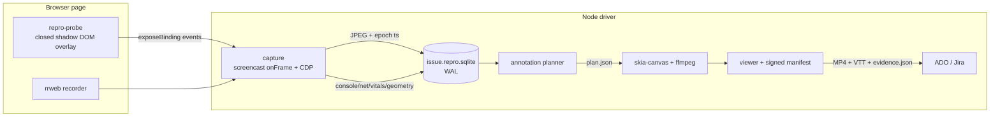

# Repro — AI-Driven Bug Reproduction Video Pipeline

## What the research changed about the design

Six parallel research passes ([Playwright capture](42a1f2e2-7946-4c6f-a99f-ee7edd6ddf12), [video compositing](1a5f3e45-0ddd-447a-ad23-b4b10afa411a), [DOM replay & masking](818c2e80-dbcf-4cb2-b05f-1a3e0ba5967e), [visual diff techniques](93d31949-8d79-4f7f-ae37-b5a5c6e297da), [AI QA ecosystem](246cf43f-5eb7-47b1-81f8-92ffa770138f), [telemetry & WebMCP](61d6b953-c6cf-45d9-a983-bbb5f732907e)) produced five findings that reshape the build:

- **Playwright 1.62 already does a third of this.** `page.screencast` (v1.59+, [docs](https://playwright.dev/docs/api/class-screencast)) gives `start({ onFrame, path, quality, size })` with per-frame **Unix-epoch timestamps**, plus `showActions({ cursor: 'pointer' })` (animated tweened cursor + action callouts), `showChapter(title, { description })`, and `showOverlay(html)` — all rendered into the captured frames. Do not rebuild these.
- **Never use Playwright's built-in encoder.** `recordVideo` is hardcoded to VP8 / 1 Mbps / `-threads 1`, which mosquito-noises text. Capture raw JPEGs via `onFrame` and encode yourself.
- **Remotion is disqualified on licensing.** Its terms define code calling `renderMedia()` as an "automation": $0.01/render with a **$100/month minimum** for orgs of 4+, and internal tooling is explicitly chargeable ([terms](https://www.remotion.dev/docs/license/terms)). Use `skia-canvas` → transparent PNG layer → one ffmpeg pass. ffmpeg 8.0.1 is already installed locally and measured ~4× realtime for 1080p30 H.264 on 8 cores.
- **PII masking must happen at the source, not in pixels.** rrweb capture-time masking never lets data leave the browser; its failure mode is loud. Pixel blur's failure mode is silent (a blur box lagging a scroll by 3 frames). Pixel redaction is a fallback for canvas/video/cross-origin iframes only.
- **For sub-5px geometry bugs, stop pixel-diffing.** CDP `DOMSnapshot.captureSnapshot` between two runs yields exact `Δx/Δy/Δw/Δh` per element with zero anti-aliasing false positives. No widely adopted OSS does run-to-run DOM geometry diffing — that is the defensible gap.

## Independent review additions

The second pass found seven material omissions:

- **Capture is a staged evidence pipeline, not one long command.** Every stage is content-addressed and resumable: `capture → normalize → analyze → redact → compose → encode → package`. A failure or annotation change invalidates only downstream outputs.
- **A browser context may contain several visual surfaces.** Every `Page` (including popups) gets its own frame stream and timeline. The final edit switches deterministically to the action-owning page, then the focused page, then the configured primary page.
- **Page screencast is not browser-window capture.** It cannot show browser chrome, permission prompts, native file pickers, print UI, or OS dialogs. An optional, explicit OS-surface backend handles those cases; silent fallback is forbidden.
- **Color correctness must be verified, not assumed.** The screencast API does not specify a color profile. Decode into a known RGBA working space, explicitly normalize to limited-range BT.709, tag both container and bitstream, and test with fixture ramps/bars.
- **The injected probe is part of the threat model.** It must not weaken CSP or Trusted Types, must avoid `innerHTML`, `document.write`, and string-to-code execution, and must fail independently of the test.
- **The MP4 is only one presentation.** Also emit an accessible interactive viewer with chapters, transcript, event timeline, and compare controls. Keep media external rather than base64-embedding it.
- **AI quality needs objective gates.** Fine-grained visual difference models remain weak: DiffSpot reports only 40.7% best recall and below 23% on hard cases. AI descriptions are advisory and cannot independently decide pass/fail.

## Architecture

**Single clock rule.** Every event stores `t_mono`, calibrated across browser
epoch, `performance.timeOrigin`, Node monotonic time, and audio time. Each frame
also stores `runId`, `pageId`, source timestamp, normalized monotonic timestamp,
dimensions, sequence, and dropped-frame count. If CFR output duplicates or
drops frames, retain the original VFR timing map in the manifest. Never use
wall time as the primary join key.

**Backpressure rule.** Browser execution must never wait on encoding, OCR, or AI.
Use bounded queues with a recorded drop policy. Dropped frames are evidence,
not silent implementation detail.

## Repo layout (pnpm workspace, Node 22, TypeScript)

- `packages/core` — event schema, clock bridge, SQLite store (`better-sqlite3`, WAL + JSON1 + FTS5), JSONL crash buffer
- `packages/probe` — in-page agent, bundled to one IIFE string for `page.addInitScript()`; **no app source changes required**
- `packages/capture` — Playwright driver: screencast, CDP domains, HAR, trace, deterministic profile
- `packages/plan` — annotation planner: text measurement, empty-region detection, collision avoidance, redaction rects, chapters
- `packages/render` — skia-canvas overlay → PNG sequence; ffmpeg filter-graph builder
- `packages/compare` — timeline warp, resample, A/B compositors, DOM geometry diff (phase 6)
- `packages/alm` — ADO + Jira clients, naming, `evidence.json`, ISO 29119 repro-step HTML
- `packages/cli` — `repro` CLI (the black-box scripts skills invoke)
- `packages/viewer` — accessible Vidstack-based report, timeline, transcript, compare controls
- `packages/contracts` — JSON Schema 2020-12 event, capability, plan, and manifest schemas
- `packages/vault` — encrypted case storage, ACLs, retention/deletion, audit events
- `skills/` — SKILL.md set, symlinked into `.agents/skills/`

## The in-page probe (`packages/probe`)

Injected via `addInitScript`, so it survives navigation and attaches to every frame. Host is a `position: fixed; inset: 0` div appended to `document.body` with a **closed shadow root**, `pointer-events: none`, and `inert` (without `inert` the overlay silently corrupts the app's tab order — fatal when you're also visualizing tab order).

Captures: rrweb (`@rrweb/record` 2.1.1, MIT — not the deprecated `rrweb` package), keystroke stream with printable/non-printable classification, pointer path + button state, `web-vitals@6` **attribution build** (`interactionTarget` and `largestShiftTarget` give CSS selectors you can turn into bounding boxes), LoAF + rAF-heartbeat freeze detection, and a geometry tracker sampling `getBoundingClientRect()` for redaction and annotation targets.

Excluded from its own rrweb recording via `blockSelector`. Renders nothing by default — visualization is opt-in per feature flag.

**Probe security contract.** Inject a prebundled script and construct all UI with
safe DOM APIs; never weaken application CSP/Trusted Types. Treat page-derived
strings as untrusted. Version the probe/driver protocol, isolate probe failures
from test execution, and declare degraded behavior for sandboxed/cross-origin
frames, workers, and closed shadow roots. Do not force closed roots open by
default because that changes application behavior.

## Mode and feature system

This is the part the agent layer depends on being unambiguous.

**Modes are mutually exclusive — exactly one per run:**

- `repro` — single run, one issue, annotated failure reproduction. Default.
- `compare` — two runs, frame-synced before/after. Layout (`side-by-side` | `onion` | `wipe` | `blink` | `difference`) is a *render parameter*, not a mode; one capture emits multiple layouts.
- `demo` — fix verification / walkthrough, no failure expected, narration-forward.

**Feature flags compose freely within a mode:** `cursor`, `keystrokes`, `clickViz`, `consoleOverlay`, `specCard`, `steps`, `pauses`, `slowmo`, `zoom`, `redaction`, `vitalsHud`, `voiceover`, `freezeDetect`, `a11yOverlay`, `hiddenElements`, `hitTargets`, `stackingContexts`, `layoutShiftViz`.

**Hard dependency and conflict rules, enforced by the config validator:**

- `compare` **requires** the deterministic profile: `page.clock` frozen, HAR-stubbed network, `reducedMotion: 'reduce'` plus injected `animation-duration: 0s`, fixed viewport + `deviceScaleFactor`, seeded `Math.random`, pinned browser build. Not optional — every unit of determinism skipped becomes alignment complexity and diff noise.
- Playwright's native `showActions` **blocks each input action ~500ms** and clears the annotation *before* the click fires. It is therefore **mutually exclusive with `timingSensitive: true`** (race-condition bugs may stop reproducing) and **must be off** on any stream fed to pixel diffing, because it burns pixels into the frame.
- `onion` / `difference` layouts require identical viewport and DSF across both runs; validator rejects otherwise.
- `voiceover` implies audio-driven segment durations, which conflicts with `preserveRealTiming`. Narration sets the pace; video segments extend via `tpad` freeze to match.
- `redaction.strict` is a **gate**: if the post-render OCR audit finds PII in the output, ALM upload is blocked, not warned.
- `a11yOverlay` / `hiddenElements` / `hitTargets` are probe-rendered (in-page). `layoutShiftViz` / paint-flashing are CDP-Overlay-rendered and gated behind a runtime probe — see spikes.
- `surfaceCapture: 'page' | 'os'` is explicit. `os` is required for browser
  chrome and native dialogs and records its additional privacy/permission
  exposure in provenance.
- `mobileEmulation` means desktop browser emulation only. Real Android/iOS
  fidelity is a future capture backend with a separate clock, telemetry, and
  security contract.

## Phase 0 — Spikes (settle before building)

Seven unresolved questions, each cheap, each capable of invalidating a design decision:

1. **Does CDP Overlay composite into `Page.startScreencast`?** Hypothesis: the compositor-debug family (`setShowPaintRects`, `setShowLayoutShiftRegions`, `setShowScrollBottleneckRects`) does; the inspector-overlay family (`highlightNode`, grid/flex overlays) does not, since `Overlay.highlightFrame` was deprecated specifically for process-separation reasons. Enable both families, capture 30 screencast frames, diff. Contingency if the inspector family is absent: use `Overlay.getHighlightObjectForTest` / `getGridHighlightObjectsForTest`, which return exact geometry **as data**, and draw it ourselves in the probe. Also note `Overlay.setShowHitTestBorders` and `setShowWebVitals` are documented dead ("no longer has any effect") — build hit-testing in-page with `document.elementsFromPoint`.
2. **Screencast client conflict.** Only one screencast client at a time; if `context.tracing.start()` runs first it silently wins and your requested `size` is ignored, shipping a 480p file. Assert actual dimensions from the first JPEG's SOF marker and fail fast.
3. **Redaction filtergraph benchmark.** `gblur` + `maskedmerge` against a generated mask video (O(1) in region count) vs. N chained `crop`/`boxblur`/`overlay` stages, at N = 1, 5, 20. Chained stages are known to degrade badly.
4. **rrweb overhead on a real app** and which option (`blockSelector` vs `ignoreSelector` vs `slimDOMOptions`) cleanly excludes our overlay without leaving a full-viewport placeholder.
5. **Color pipeline.** Encode sRGB/full-range ramps and color bars through the
   complete JPEG → RGBA → H.264 path; verify decoded values and metadata across
   Chrome, Safari, VLC, Jira preview, and the viewer. Compare `zscale` and
   `scale` conversions rather than assuming either is correct.
6. **Multi-page first-paint capture.** Open popups during rapid navigation and
   prove capture starts before meaningful first paint; verify the editorial
   switch policy and event/page ownership.
7. **Strict-page compatibility.** Run the probe against CSP + Trusted Types,
   sandboxed iframes, cross-origin iframes, and closed-shadow fixtures and
   verify fail-soft behavior without weakening the page.

## Phase 1 — Capture spine

`repro capture --config repro.config.ts`. Probe injection,
`screencast.start({ onFrame })` per page, CDP
`Runtime.consoleAPICalled` + `Log.entryAdded` +
`Runtime.exceptionThrown`, HAR, trace, and deterministic profile. SQLite is the
transactional source of truth; deterministic JSONL is an export/recovery
format, not a second independently written authority. Events carry monotonic
sequence IDs, schema versions, and a hash chain.

JPEG screencast frames are **not forensic pixel truth**. Use them for smooth
playback, AI sampling, and annotation timing, but also capture lossless
device-scale PNG anchors at action boundaries, assertion failures, layout
shifts, console exceptions, and compare anchors. Pixel/geometry claims cite
those anchors. Preserve the native screencast file as a source artifact even
though its codec/bitrate is unsuitable as the delivery file.

Record page lifecycle, opener, focus/visibility, navigation, and action
ownership. Emit explicit cut events using this priority: action-owning page →
focused page → configured primary page. Support picture-in-picture later; do
not add it to the capture spine.

Encode after explicit RGB/full-range → BT.709/limited-range conversion:
`libx264 -crf 18 -preset medium -pix_fmt yuv420p -profile:v high`,
`-color_primaries bt709 -color_trc bt709 -colorspace bt709 -color_range tv`,
`-video_track_timescale 90000 -movflags +faststart`. Verify with `ffprobe`;
metadata flags alone do not transform pixels. Prefer high-luma-contrast
annotation text so 4:2:0 subsampling does not destroy thin glyphs.

Run capture and render in an immutable OCI image digest. Record the image
digest, kernel, architecture, Playwright/browser/ffmpeg/skia versions, locale,
timezone, viewport, DPR, GPU mode, and a font manifest with family/style/source
and SHA-256. Compare mode fails on material environment differences unless the
user explicitly overrides them.

Support two explicit execution profiles:

- `faithful` (default for reproduction): preserve real timing, randomness,
  service workers, and live network behavior so instrumentation does not erase
  a race or timing bug.
- `controlled` (required for compare): fixed clock/seed/locale/timezone,
  HAR-backed network, pinned data, and optionally blocked service workers.

rrweb remains an inspectable DOM-history aid, not evidence of exact pixels or
executed behavior.

## Phase 2 — Annotation layer

Planner emits `plan.json`. Render ordinary text, boxes, subtitles, and chapters
with ASS/libass and native ffmpeg filters. Use `skia-canvas` only for sparse
transparent frames that need custom geometry, leaders, masks, or animation.
This avoids decoding and redrawing every frame for simple overlays while
retaining one final encode.

- **Cursor and clicks** — Playwright `showActions({ cursor: 'pointer' })` for pointer actions; probe-drawn ripples for right-click, tap, drag paths, and scroll (Playwright's cursor only moves for pointer actions, not `fill`/`press`).
- **Keystrokes** — genuine gap in the ecosystem (only `demowright`, 0 stars, attempts it). Probe-rendered badge stack, configurable: always show modifier combos and non-printable keys; suppress printable keys that land in a form field.
- **Console errors** — one-line `file:line` via source-map resolution of frame 0 only (CDP is 0-based lines, `source-map` is 1-based — the classic off-by-one), deduped with `message ×47` counts and token-bucket throttled. Trigger highlighting: correlate to the last user action within 2s and draw a fading box on its recorded bounding box.
- **Spec card** — intro frames from UA-CH high-entropy values, DPR, viewport, timezone, `navigator.connection`, WebGL/WebGPU adapter, plus Node-side `browser.version()`, OS, and CI/Docker detection. Every field must render "unknown" gracefully; 2026 privacy coarsening means several are bucketed or blank.
- **Steps, chapters, pauses, slow-mo, zoom** — `tpad stop_mode=clone` for holds (verified: 4s + 1.5s freeze = exactly 5.5s), `setpts` for slow-mo with a speed badge drawn inside the slowed segment. Skip `minterpolate`: 10–50× slower and it warps text.
- **Text collision avoidance** — measure with `opentype.js`, sample a keyframe per segment downscaled to a 32×18 variance grid, place callouts in the largest low-variance rectangle that fits and doesn't overlap the ROI, with leader lines to target.
- **Chapters** — write MP4 chapters and a sidecar `chapters.vtt`, but **burn navigation into pixels**: browsers ignore MP4 chapter atoms entirely and Azure DevOps doesn't preview video at all. A visible step counter and ticked progress bar are the only chapter UI that reaches a reviewer.
- **"Click to continue" is not achievable in a video container.** Ship freeze frames with a visible PAUSED badge and countdown; that is the only form that survives being downloaded and opened in VLC.

## Phase 3 — Redaction, four layers

1. **Source** (mandatory): rrweb defaults inverted to `maskAllInputs: true` + `maskTextSelector: '*'`, unmask by allowlist. Guard the `undefined`-via-object-spread hole that silently overrides safe defaults.
2. **Stream**: Presidio (MIT) over the rrweb event text before persistence.
3. **Pixel** (canvas / video / cross-origin iframe only): DOM boundingBox track → union-expanded across sample intervals + 8–16px padding → mask video → `gblur` + `maskedmerge`. **Pixelize, never blur, for anything that must not be recoverable.** During scroll plus a 200ms trailing window, expand to a full-width viewport band — compositor-thread scroll can outrun a main-thread rAF sampler precisely when the page is janky.
4. **Audit**: OCR the *output* at 1fps → Presidio → any hit blocks upload.

Redaction happens before data crosses each trust boundary: source masking before
persistence where possible, stream filtering before model access, and pixel
redaction before encoding/upload. Never retain original secrets in audit logs;
store rule IDs and affected regions only. Add canary-secret tests spanning
frames, DOM events, console/network payloads, captions, caches, reports,
manifests, and uploaded artifacts. OCR remains defense-in-depth, never a
completeness guarantee.

HAR capture is deny-by-default: remove authorization/cookie headers, query
values, OAuth codes, signed URLs, WebSocket payloads, and request/response
bodies before persistence. Bodies require endpoint, content-type, and field
allowlists. Apply the same sanitization policy to screenshots, traces,
thumbnails, filenames, manifests, subtitles, prompts, and model outputs.

Treat every page, log, filename, SVG/HTML fragment, archive, and OCR result as
hostile evidence. Models receive verified, redacted, non-executing derivatives
with evidence-offset citations and **no credentials, shell, network egress, ALM
write tools, or cross-case retrieval**. Human approval remains required for
publication.

## Phase 4 — ALM (both, day one)

- Naming: `{ISSUEID}__{slug}__{env}__{sha7}__{ISO8601Z}.mp4` — e.g. `BUG-1234__cart-total-nan__staging__a1b2c3d__20260727T211500Z.mp4`. Double underscore delimiter, no spaces (Xray's step-attachment API breaks on spaces), ISO8601 basic UTC so filenames sort chronologically.
- **No installed MCP server can upload attachments** — all four are download-only. Use MCP for work-item create/update, our own script for binaries.
- Azure DevOps: two-step — `POST /_apis/wit/attachments?fileName=...` (raw binary) then `PATCH /_apis/wit/workitems/{id}` adding an `AttachedFile` relation. **60MB hard cap, unraisable**; budget ≤40MB. Emit `Microsoft.VSTS.TCM.ReproSteps` and `Microsoft.VSTS.TCM.SystemInfo` as **HTML**, not Markdown. Never touch the same field reference name twice in one patch document.
- Jira: `POST /rest/api/3/issue/{key}/attachments`, multipart field named exactly `file`, header `X-Atlassian-Token: no-check` (omit it and you get 403). Discover the limit at runtime via `GET /rest/api/3/attachment/meta`.
- `evidence.json` sidecar: environment, build SHA, browser, viewport, step timeline, per-step durations, geometry deltas, and SHA-256 for every artifact. Canonicalize before signing; support a KMS-backed signature profile. C2PA-signed MP4 is optional for externally distributed evidence, not required for ordinary Jira/ADO attachments.
- Repro-step document structured per ISO/IEC/IEEE 29119-3 with `Attempts to Repeat` populated by running the generated spec N times and recording the hit rate.
- Add configurable retention/deletion policy hooks and an audit trail for
  capture, redaction, model access, upload, download, and deletion.

The encrypted evidence vault is authoritative; Jira/ADO receive sanitized
previews, concise metadata, and an authorized viewer link. Direct attachment of
the canonical bundle is an explicit deployment policy, not the default.
Encrypt SQLite/WAL/temp/cache data with per-case envelope keys where the hosted
profile is used.

ALM publication uses an outbox and idempotency key derived from destination,
issue, artifact digest, and role. After upload, immediately download and verify
length and SHA-256, then persist the platform attachment ID and signed-manifest
digest in the ticket. Preview transcodes are separate derivatives, never the
authoritative artifact.

## Phase 5 — Skills and agent orchestration

Reuse rather than reinvent: `@playwright/cli` skills (Apache-2.0) for capture verbs, the qaskills triage matrix (its "real bug → report with repro, do **not** fix the test to pass" rule), TestSprite's failure-bundle output contract, `video-debug` so the agent can verify its own recording before attaching it.

New skills in `skills/`, thin wrappers over `repro` CLI verbs so credentials and implementation never enter agent context:

- `repro-capture` — mode selection, feature flags, conflict validation, deterministic profile
- `repro-annotate` — maps bug classes to default feature sets (a CLS bug turns on `layoutShiftViz` + `zoom` + slow-mo at the shift; a freeze bug turns on `freezeDetect` + `vitalsHud` + LoAF script attribution)
- `repro-compare` — phase 6
- `repro-file` — ALM ticket + attachment
- Two-phase agent discipline: exploratory discovery (LLM-driven, once) emits a committed deterministic `*.spec.ts`; CI reruns it with **no LLM in the loop**.

All AI-authored plans use versioned JSON Schemas, constrained enums, evidence
references, and confidence fields. The validator rejects invented selectors,
timestamps, events, or unsupported capabilities. AI suggests annotations; a
deterministic planner resolves placement and rendering.

Treat discovery as a versioned compiler front end. Every proposed action stores
its stable target, assumptions, evidence references, confidence, model/provider
ID, prompt digest, token usage, and source-artifact digests. A deterministic
validator rejects unsupported targets, ungrounded annotations, unsafe actions,
and budget violations.

## Phase 6 — Before/after comparison

**Frame sync, the key design decision:** do not use DTW as the default. Align
steps as zero-or-one matches, preserving insertions, deletions, retries,
branches, and unmatched steps rather than forcing one-to-one correspondence.
For matched steps, build a synthetic canonical timeline with duration
`max(durA, durB)`, warp each run piecewise-linearly, and resample with
zero-order hold. Reserve banded DTW for long animated matched steps only,
never across boundaries, with stored alignment evidence and confidence.
Uncertain matches require review.

Surface the timing difference rather than hiding it: caption each segment "Step 3: click Save — before 412ms / after 1180ms (+768ms)". A 3× slowdown is often the actual bug.

Render layouts from the resampled frame tables: `xstack` side-by-side with label gutters; `format=rgba,colorchannelmixer=aa=0.5` + `overlay` onion-skin; amplified `blend=all_mode=difference` + `eq=contrast=8` + red channel isolation; two-colour Sobel edge overlay (a 2px shift shows as separated red/cyan fringes whose gap *is* the delta); auto-blink at 2–4Hz.

**DOM geometry diff is the primary detector, pixels are confirmation.** `DOMSnapshot.captureSnapshot` at each step boundary in both runs → element identity matching (`data-testid` → structural path → content fingerprint → LCS fallback) → exact `Δx/Δy/Δw/Δh` → classify as moved / resized / appeared / disappeared / restyled → band by magnitude (<1px ignore, 1–3px info, 3–10px warn, >10px critical) → render as an annotated dimension line captioned `Δx = +3px` on the correct frame. Borrow Galen Framework's spec vocabulary for descriptions ("`.save-button` moved from `left-of .cancel 12px` to `9px`") — far better than a pink rectangle.

`DOMSnapshot` is a Chromium enhancement, not the cross-browser contract.
Firefox/WebKit degrade to locator/ARIA identity plus screenshots. Compare only
equivalent viewport, DPR, fonts, locale, and capture conditions.

Gate expensive per-pixel work behind `blend=difference` + `blackframe` + `metadata=print`, which emits a machine-readable list of differing frames.

## Phase 7 — Voiceover and extras

Kokoro-82M (**Apache 2.0, weights included**, ~6× realtime on CPU). Avoid Piper (relicensed GPL-3.0), XTTS v2 and F5-TTS (non-commercial weights, and Coqui dissolved so XTTS is permanently unlicensable). Synthesize per segment, measure with `ffprobe`, let audio duration drive video segment length.

Generate voiceover, WebVTT captions, and transcript from one canonical narration
document. Record model, voice, language, speed, pronunciation overrides, and
script hash. Voiceover is optional and never the sole carrier of information.

## Viewer and visual design contract

Ship a strict-CSP report viewer using MIT-licensed Vidstack with **external**
MP4, VTT, thumbnail, manifest, and event assets; never base64-embed media
(~33% size overhead). The MP4 remains independently usable.

The canonical team experience is an authenticated HTTPS viewer with shareable
timestamp/annotation/mode URLs. Jira/ADO receive the link, a compact poster,
the H.264 fallback, and a text summary/transcript. Do not make an executable
HTML attachment or per-report PWA the sole review path.

Before a Claude Design pass, define:

- DTCG 2025.10 design tokens for surfaces, text, emphasis, severity, focus,
  typography, spacing, motion, annotation strokes, and safe/redacted regions.
- Light, dark, and high-contrast themes; no meaning encoded by color alone.
- A machine-readable annotation grammar:
  `kind`, `severity`, `timeRange`, `target`, `label`, `shape`, `icon`,
  `lineStyle`, `placement`, `priority`, `collisionPolicy`, `confidence`.
- At least two semantic signals per state (for example hue + icon/shape/text),
  visible focus, keyboard-complete controls, reduced motion, and 3:1 non-text /
  4.5:1 normal-text contrast targets.
- Reserved caption, title, progress, and browser-content safe regions plus
  deterministic overlap/collision priorities.
- Timeline minimap, step/diff navigation, transcript seeking, chapter menu,
  uncertainty display, and side-by-side/onion/wipe/blink controls.
- Responsive layouts and explicit empty/loading/error/redaction-blocked states.
- Reviewer presets over the same evidence model: developer (console/network),
  tester (steps/expected/actual), product (impact/narrative), and ALM (compact
  metadata). Annotation review states are `open`, `resolved`, `dismissed`, and
  `verified` without mutating source evidence.
- Opening and ending slates with outcome, environment, sanitization status,
  expected/observed result, and evidence limitations. Keep critical export
  text inside a 5% title-safe inset.

Claude Design may refine tokens, information architecture, visual language,
responsive layouts, and accessibility. It must not change event semantics,
timing, redaction rules, provenance, or confidence calculations.

## Capability and stage contracts

Describe capture, probe, analyzer, renderer, redactor, voice, tracker, and
uploader capabilities with JSON Schema 2020-12: stable ID/version, protocol
compatibility, browser/platform support, permissions/secrets, input/output
artifact types, determinism, and redaction guarantees. Validate before
execution. Do not load arbitrary third-party code in-process in the MVP.

Stage outputs are written atomically with completion markers. Cache keys hash
inputs, normalized configuration, code revision, model/tool versions, fonts,
and environment manifest. Resume from the last verified stage and invalidate
downstream stages only.

Use bounded resource classes (`browser`, `ffmpeg`, optional `gpu`, `upload`)
with cancellation, deadlines, retry classification, and cost/artifact-size
budgets. Cache hits acquire no scarce resource. Add a durable workflow engine
only if runs later span machines or must survive coordinator replacement.

## Quality and evaluation

Use three layers:

1. **DiffSpot** for fine-grained CSS/UI difference recall and no-diff
   specificity.
2. **WUICC** as a secondary synthetic benchmark for change descriptions.
3. A versioned, human-labeled internal corpus of real repro, timing,
   redaction, multi-page, and compare cases as the release gate.

Track detection precision/recall, hallucination rate, target-region IoU,
step-alignment error, redaction leakage, render determinism, runtime/file-size
budgets, and reviewer usefulness. VLM output is advisory; deterministic
telemetry and policy gates control pass/fail.

Every run emits a machine-readable `QualityReport`; pipeline completion is not
success. Keep dimensions separate: replay outcome, expected assertion
reproduced, target/state identity, evidence coverage, video readability,
annotation grounding, environment completeness, redaction status, and detected
nondeterminism. A summary score may aid sorting but cannot hide a failed
required dimension.

## Deliberately deferred

- **C2PA:** optional packaging profile for externally distributed evidence.
  Always produce a canonical signed checksum manifest first.
- **OpenTimelineIO:** optional export for handoff to professional editors;
  never the canonical timeline because JS bindings remain immature.
- **Real-device mobile:** future backend. Desktop emulation remains supported
  but is not represented as real-device evidence.
- **Arbitrary plugins/workflow engines:** capability schemas and resumable CLI
  stages are sufficient until real extension demand appears.

## Licensing constraints to respect

- **Remotion** — avoid entirely in the render path (see above).
- **OpenReplay** (AGPLv3) — read its architecture and its Spot extension as the closest prior art; do not link against it.
- **Hercules / testzeus** (AGPL-3.0) — do not prototype without legal review.
- Safe: rrweb (MIT), Presidio (MIT), Kokoro (Apache 2.0), pixelmatch (ISC), odiff, `better-sqlite3` (MIT), Playwright (Apache-2.0), Tooluminati (MIT).

## Tooluminati integration (optional richer mode)

Reuse `@tooluminati/diagnostics` + `@tooluminati/state` tool factories and its `redactObject` cycle-safe serializer for app/store state (Redux/Zustand/Jotai/TanStack Query/Apollo), called directly via `page.evaluate()` — no WebMCP browser support needed. Its `MODEL_CONTEXT_MOCK_INIT_SCRIPT` gives the full WebMCP call shape in stock Chromium with no flags. Do **not** use its timeline: ISO-string timestamps, a 50-event ring buffer, and a read limit hard-clamped to 20 make it unusable for frame-accurate overlay. Skip native WebMCP for now — `executeTool()` isn't in the W3C IDL, it's Chrome-only, it flattens all tool errors to `UnknownError`, and the API shape changed three times in ten weeks.