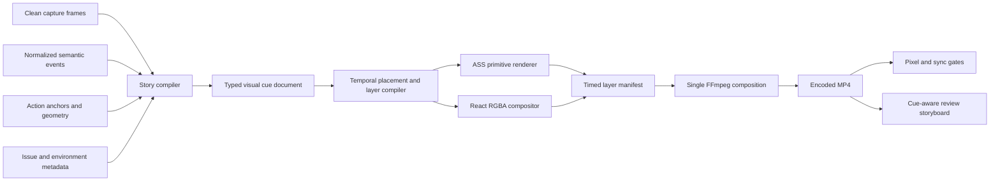

# Repro visual fidelity recovery

## Outcome

The deliverable is a coherent evidence video system matching:

- `/home/cory/Downloads/Repro Video System.dc.html`
- `/home/cory/Downloads/Repro tool video enhancement (1).zip`
- `docs/design-brief.md`
- `docs/design-recs/video-system-spec.md`

The source files under `Downloads` are review inputs, not runtime dependencies.
Approved reference images, measurements, and tokens must be copied into
versioned test assets before implementation begins.

This plan supersedes the visual, annotation, comparison, viewer, and quality
items marked complete in the earlier pipeline plan. The rendered outputs show
that those completion markers describe API breadth, not product completion.

## What was actually reviewed

The audit used six-frame contact sheets for all 17 delivered MP4s, targeted
frame inspection around visible cue transitions, and direct inspection of the
corresponding `plan.json`, `overlay.ass`, composition JSON, compositor output,
and filter graphs. This is not a claim that every one of the roughly 450 frames
in every 15-second video was manually inspected.

The replacement acceptance harness in Phase 0 closes that gap by extracting
every cue boundary and midpoint, plus a regular one-frame-per-second sequence,
from the encoded MP4.

Reviewed outputs:

1. `annotate-multi-shape`
2. `demo-walkthrough`
3. `package-quality`
4. `repro-a11y-keyboard`
5. `repro-badge-flicker`
6. `repro-cls-zoom`
7. `repro-console-multi`
8. `repro-functional-menu`
9. `repro-hover-hidden`
10. `repro-multipage-popup`
11. `repro-pointer-right-drag`
12. `repro-redaction-strict`
13. `repro-timing-pause-slowmo`
14. `compare-geometry-misalign` broken
15. `compare-geometry-misalign` fixed
16. `agent-BUG-1001` broken
17. `agent-BUG-1001` fixed

## Confirmed current failures

### Competing UI renderers

`CaptureSession.showChapter()` emits `step.chapter` and also calls
Playwright `screencast.showChapter()`. The title is therefore burned into the
raw capture before planning. The ASS pass then renders the same title as both
a top-left `Badge` and a bottom-center `Chapter`.

This is the exact source of the three "Inspect Save alignment" treatments:

- center: Playwright's native captured chapter;
- top left: ASS `Badge`;
- bottom center: ASS `Chapter`.

`showActions()` and probe-rendered cursor, key, accessibility, and vitals UI
create the same ownership problem for other features.

### The step contract does not contain a step counter

The current badge receives the chapter title. It has no canonical step index
or total, so it cannot render `STEP 1 / 3`. Several independent annotations can
also be emitted for one chapter without shared identity.

### Interaction telemetry does not match planner predicates

The probe emits `probe.pointer:path` and stores `pointerdown`,
`pointermove`, or `pointerup` in `payload.phase`. Feature emitters search the
event kind for `pointerdown`, `pointermove`, and similar strings. Pointer
visuals are therefore skipped.

Pointer events carry coordinates and a selector path but no target bounding
box. Keyboard events carry a selector but no target bounding box. The planner
cannot create reliable target rings or displaced callouts from this data.

### Existing ring geometry is not a reliable visible stroke

The ASS file contains open vector paths under styles configured as opaque box
styles. A plan can contain `target-ring` and a dialogue event while the encoded
pixels contain no clear ring. The current presence gate checks the former.

### Collision handling is not temporal

Placement aggregates target and annotation bounds without testing whether
their output time ranges overlap. Cues from different beats can displace each
other even though they are never on screen together. This contributes to
arbitrary corner placement and unnecessary leader lines.

### Rich compositor components are dead ends

React components exist for slate, console toast, ROI magnifier, vitals HUD,
outcome pair, and compare chrome. `annotate` only renders and passes the slate.
Other compositor annotations do not become timed FFmpeg inputs.

### The slate accepts duplicate identity text

BUG-1001 can be provided as both `bugId` and `title`. The slate renders both
without coalescing or reporting the missing human title.

### Compare contracts are ahead of compare output

The compare package can describe layouts, deltas, and sync knots, but the
encoder path does not apply the sync map to both streams and does not assemble
the reference composite frame. Existing fixture step IDs differ between the
broken and fixed runs, so the nominal anchor set is empty. Side-by-side filter
strings stack full-size inputs instead of placing synchronized sources in the
two 612x345 panes of a 1280x720 frame.

`CompareChrome` is rendered only in a unit-level card path. It is not part of
the finished comparison MP4.

### Duration padding is visible as dead footage

Sparse captures are extended to satisfy a duration number, but the additional
time is not compiled into meaningful setup, action, evidence, and outcome
beats. A metadata duration pass can therefore hide a long static tail.

### Quality gates do not inspect the product

- The contrast gate is explicitly skipped and always passes.
- The compare gate checks labels and delta objects in JSON, not the MP4.
- The frame-accuracy capture test is skipped.
- Overlay presence checks annotation count, not changed pixels.
- Compositor tests verify PNG headers and caching, not visual parity.
- No gate proves step text, target rings, or compare chrome are visible.

## Target visual language

### Canonical tokens

`packages/contracts/tokens/overlay-theme.tokens.json` remains the only token
source. Generated TypeScript, CSS, and ASS values must be derived from it.

Required color roles:

- add / after: `#1B7F4A`
- remove / critical: `#C42020`
- change: `#C47A00`
- info / neutral step: `#2457D6`
- warning / freeze / CLS: `#996200`
- left click: `#0B8FAD`
- right click: `#B13D8C`
- label foreground: `#FFFFFF`
- label background: `#202020E6`
- slate background: `#101319`
- before: `#5B6B8C`
- metadata: `#B8BFCC`
- ring halo: `#FFFFFFE6`
- plate hairline: `#FFFFFF2E`
- scrim: `#10131980`
- progress: `#FFFFFFBF`

Required burn-in typography:

- DejaVu Sans and DejaVu Sans Mono;
- 32px semibold slate title;
- 15px slate metadata;
- 17px medium callout;
- 11px bold uppercase kicker with 0.13 tracking;
- 14px bold tabular badge;
- 14px single-line monospace console text.

Required frame rules:

- 1280x720 at device scale factor 1;
- 24px safe inset;
- 96px reserved bottom band;
- no more than one bottom-band occupant at a time;
- labels truncate at 42 characters rather than wrapping over evidence;
- every accent stroke has a one-pixel white outer halo;
- color is always paired with text, icon, line style, or geometry.

Required motion:

- slate dissolve: 320ms;
- plate in: 150ms fade plus scale from 0.96;
- plate out: 250ms fade;
- click ripple: 350ms expand and fade, at most three per second;
- toast in: 200ms slide and fade;
- toast out: 400ms fade;
- no flashing above 2Hz.

### Overlay Kit completeness

The finished encoder must support and visually test:

1. target ring;
2. leader and arrowhead;
3. plate / callout with kicker and measurement;
4. numbered step badge;
5. four-pixel progress rail;
6. chapter lower third;
7. console toast and trigger highlight;
8. pause badge;
9. speed chip;
10. left, right, and drag click visualization;
11. cursor path;
12. keystroke pill;
13. layout-shift before/after pair;
14. hit-target guide;
15. hidden-element ghost;
16. stacking-context labels;
17. ROI magnifier;
18. freeze banner;
19. vitals HUD;
20. redaction treatment;
21. expected/actual outcome pair;
22. delta caption;
23. opening slate.

### Opening Slate completeness

Implement all three modes from one component:

- repro;
- demo;
- compare.

The slate must support issue identity, human title, application, browser, OS,
viewport, profile, locale, timezone, build, capture time, step count, duration,
outcome, and compare pane metadata where applicable.

If normalized `title` equals normalized `bugId`, render the ID once and record
a missing-title diagnostic. Filing requires a human title. Local annotation
may continue with the duplicate suppressed.

Slate rendering is fail-closed when configured. A compositor failure must fail
`annotate`; it must not silently ship a video without the opening slate.

### Composite Frame completeness

All layouts consume the same synchronized source pair and shared chrome:

- side-by-side;
- onion;
- wipe;
- cropped ROI;
- difference;
- edge;
- blink, explicit opt-in only.

The default side-by-side output is 1280x720 with two 612x345 content panes,
before/fixed labels, build metadata, issue ID, numbered step, delta caption,
shared output rail, source-duration bars, and drift ticks for low-confidence
spans.

Onion uses 45% before opacity, distinct before/after rings, a direction arrow,
and a textual legend. Wipe rests at 50% for at least one second and keeps both
pane identities visible. Blink remains below or equal to 2Hz and emits an
accessibility warning.

## Target data flow



The pipeline has one owner for each visual. Capture records facts. Planning
decides narrative and timing. Renderers draw. FFmpeg composites. No renderer
may introduce an unplanned user-visible label.

## Phase 0 — Version the reference and establish a truthful baseline

### Work

- Add approved reference crops for Overlay Kit, Opening Slate, Composite Frame,
  and Broadsheet viewer under `docs/design-recs/goldens/`.
- Record reference coordinates, type metrics, colors, spacing, and component
  states in a machine-readable visual conformance manifest.
- Add a `repro review-video` or evaluation API that extracts:
  - slate midpoint;
  - every cue start plus 50ms;
  - every cue midpoint;
  - every cue end minus 50ms;
  - every compare knot;
  - one regular frame per second;
  - the final frame.
- Produce an HTML or viewer storyboard with the frame, cue IDs, expected
  components, actual component pixel result, and gate status.
- Preserve the current 17 outputs as the failing baseline.
- Record whether each result came from a real gate, a skipped gate, or a
  synthetic quality value. Never present hardcoded quality data as evaluation.

### Primary files

- `docs/design-recs/`
- `packages/evaluation/src/frames.ts`
- `packages/evaluation/src/review/`
- `packages/cli/src/commands/`

### Acceptance

- Each reviewed video has a cue-aware storyboard, not only a uniform contact
  sheet.
- A report distinguishes plan inspection, overlay-source inspection, sampled
  finished-video inspection, and exhaustive machine frame checks.
- Golden updates require an explicit command and produce a reviewable diff.

## Phase 1 — Capture clean evidence, not presentation UI

### Work

- Split probe instrumentation from probe presentation.
- Disable Playwright `showChapter()` and `showActions()` in delivery capture.
- Stop probe cursor ripples, keystroke pills, accessibility paint, and vitals
  HUD from being burned into delivery frames.
- Keep an explicit `capturePreviewUi` debug option for local diagnostics. Mark
  its artifacts non-fileable and invalid for compare inputs.
- Continue emitting semantic chapter, action, pointer, key, geometry, vitals,
  accessibility, console, and freeze events.
- Add a source-cleanliness manifest field and reject compare when either source
  contains capture-preview UI.

### Primary files

- `packages/capture/src/capture-session.ts`
- `packages/probe/src/probe-source.ts`
- `packages/core/src/schema.ts`
- `packages/contracts/schemas/config.schema.json`
- `docs/ai-usage.md`

### Acceptance

- BUG-1001 raw capture contains no centered chapter card.
- A click causes no Playwright label in the raw source.
- Enabling preview UI is explicit and makes filing and compare validation fail.
- Timing-sensitive behavior remains unchanged because no presentation action
  blocks the page under test.

## Phase 2 — Normalize semantic events and resolve geometry

### Work

- Add a capture-side normalized `action.semantic` event containing:
  - stable `actionId`;
  - stable `stepId`;
  - phase and action type;
  - selector and composed selector path;
  - target bounding box;
  - pointer point and button;
  - page ID;
  - before and after anchor references;
  - monotonic timestamp.
- Resolve target geometry in the page at event time. Do not defer selector
  lookup until after navigation or layout changes.
- Normalize ALM metadata so the slate uses `System.Title` as the human title.
- Parse approved annotation hints into typed geometry evidence rather than
  leaving them in issue JSON. BUG-1001 must resolve `btn-save`, capture its
  before/after anchors, and retain the `-12px` expected delta.
- Map `probe.pointer:path` using `payload.phase`; do not infer phase from kind.
- Add geometry to keyboard and focus events.
- Emit data, rather than rendered probe UI, for:
  - tab order;
  - hit-target size;
  - hidden element geometry;
  - stacking context;
  - layout-shift before/after rectangles;
  - vitals attribution;
  - freeze spans.
- Introduce `markStep({ id, title })`. Keep `showChapter(title)` temporarily as
  a compatibility wrapper with an identity based on normalized title and
  occurrence ordinal.
- Use explicit step IDs for compare fixtures.

### Primary files

- `packages/probe/src/probe-source.ts`
- `packages/capture/src/capture-session.ts`
- `packages/capture/src/anchors.ts`
- `packages/core/src/schema.ts`
- `packages/contracts/schemas/event.schema.json`
- `packages/e2e-fixture/src/scenarios/drivers.ts`

### Acceptance

- Pointer down, move, up, right click, and drag events reach the planner.
- Every interactive cue has a point; target-bound cues also have a valid bbox.
- Broken and fixed BUG-1001 runs produce matching stable step anchors.
- Geometry references identify the exact frame and page used as evidence.

## Phase 3 — Introduce typed visual contracts

### Work

- Add a new versioned visual document rather than overloading `label` and
  `bounds` for every component.
- Use a discriminated TypeScript and JSON Schema union. Each component owns its
  required content:
  - step badge: index, total, title;
  - console toast: level, message, timestamp, trigger target;
  - layout shift: before rect, after rect, dx, dy, dw, dh;
  - outcome: expected and actual;
  - ROI: source rect, magnification, destination rect;
  - compare delta: class, values, caption, before/after targets.
- Define cue timing, renderer, layer, target, placement, motion, accessibility
  text, and source evidence in the contract.
- Define a `RenderedLayerManifest` with PNG or ASS source, start/end, z-index,
  opacity/motion expression, expected alpha bounds, and cue ID.
- Preserve v2 annotation reading for existing packages. New plans emit the new
  visual document and a derived compatibility view.

### Primary files

- `packages/contracts/schemas/`
- `packages/contracts/src/types.ts`
- `packages/contracts/src/zod.ts`
- `packages/plan/src/types.ts`
- `packages/render/src/types.ts`
- `packages/compositor/src/types.ts`

### Acceptance

- It is impossible to construct a step badge without index and total.
- It is impossible to construct an outcome pair without expected and actual.
- Every rendered layer maps back to exactly one planned cue.
- Schemas reject missing component-specific visual data.

## Phase 4 — Compile one coherent story

### Work

- Build a canonical `StepModel` from explicit steps and action boundaries.
- Assign every cue to one step and one narrative beat.
- Give visual ownership to one component:
  - step badge persists during the step;
  - chapter lower third appears once at step entry;
  - progress rail reflects step index;
  - target callout describes the action and does not repeat the chapter;
  - outcome pair appears once at the end.
- Deduplicate cues by semantic key, target, and overlapping output range.
- Merge simultaneous freeze events into one banner and one beat.
- Do not use the issue ID as a title fallback.
- Replace unlabeled tail padding with content-aware beat allocation:
  - setup frame;
  - action;
  - observed result;
  - expected/actual outcome.
- Cap each hold at the design typical duration unless narration or a named
  evidence beat requires more time.
- If meaningful content cannot reach the filed-repro target, report the short
  duration instead of adding an unexplained frozen tail.

### Primary files

- `packages/plan/src/planner.ts`
- `packages/plan/src/features.ts`
- `packages/plan/src/timeline.ts`
- `packages/plan/src/slate.ts`
- `packages/plan/src/story.ts`

### Acceptance

- "Inspect Save alignment" appears as one chapter transition and one numbered
  step identity, never as three identical labels.
- No two overlapping cues carry identical normalized text and target.
- A 15-second output contains named evidence beats throughout its duration.
- Final expected/actual evidence is visible for at least 2.5 seconds.

## Phase 5 — Make placement temporal and deterministic

### Work

- Compute occupancy only among cues whose output ranges overlap.
- Reserve the 24px safe inset and 96px bottom band.
- Keep the primary target unobscured.
- Place a callout near its target; add a leader only when displaced.
- Add a real arrowhead when direction is part of the evidence.
- Enforce one bottom-band occupant at any output time.
- Reserve persistent slots for step, vitals, pause/speed, and compare chrome.
- Establish the layer order:
  1. source;
  2. redaction;
  3. compare panes;
  4. target geometry;
  5. leaders;
  6. plates;
  7. diagnostics and toasts;
  8. step and progress;
  9. outcome scrim;
  10. slate transition.
- Generate an occupancy trace for debugging and gate failures.

### Primary files

- `packages/plan/src/collision.ts`
- `packages/plan/src/planner.ts`
- `packages/plan/src/placement.ts`
- `packages/evaluation/src/gates/placement.ts`
- `packages/evaluation/src/gates/bottom-band.ts`

### Acceptance

- Cues in different beats cannot displace each other.
- No ordinary callout plate occupies the central evidence region.
- Target overlap, safe-zone violations, and bottom-band collisions fail tests.
- Placement is byte-for-byte deterministic for identical input.

## Phase 6 — Connect plan, compositor, ASS, and FFmpeg

### Work

- Convert every compositor cue into a deterministic full-frame RGBA PNG or
  transparent frame sequence.
- Pass compositor results to the encoder through `RenderedLayerManifest`.
- Add explicit loop/framerate handling for static PNG layers.
- Enable each layer only inside its planned output time range.
- Compile fade, scale, slide, and ripple motion from theme tokens.
- Keep ASS for efficient vector primitives and short deterministic text.
- Use React compositor cards for rich layouts and cards.
- Render redaction before any presentation layer.
- Emit an overlay-only diagnostic video and alpha storyboard beside the MP4.
- Fail encoding if a planned visual layer has no rendered source.

### Primary files

- `packages/compositor/src/render.ts`
- `packages/compositor/src/card-view.tsx`
- `packages/render/src/encode-pipeline.ts`
- `packages/render/src/filtergraph.ts`
- `packages/render/src/ass.ts`
- `packages/cli/src/commands/annotate.ts`

### Acceptance

- Console toast, ROI magnifier, vitals HUD, outcome pair, and compare chrome
  appear in finished MP4s.
- Every planned layer changes pixels inside its expected alpha bounds.
- No unplanned compositor file is ignored silently.
- All output remains 1280x720, 30fps, BT.709, H.264, and yuv420p.

## Phase 7 — Implement the full Overlay Kit

### ASS primitive work

- Replace open-path pseudo-rings with visible hollow ring geometry.
- Render halo and accent as two deterministic strokes or compound paths.
- Support rect, ellipse, underline, solid, dashed, and dotted treatments.
- Add leader arrowheads.
- Add distinct left/right click colors and drag-path behavior.
- Render step text as `STEP N / M`, not as the chapter title.
- Render the four-pixel progress rail from the step fraction.

### React component work

- Finish console toast, trigger ring, ROI magnifier, vitals HUD, outcome pair,
  freeze banner, and comparison chrome against the reference.
- Add missing component views for layout shift, hit target, hidden ghost,
  stacking context, pause/speed, keystroke, and delta caption where ASS is not
  sufficient.
- Implement 42-character truncation and component-specific text rules.
- Use only generated token variables.

### Primary files

- `packages/render/src/ass.ts`
- `packages/render/src/theme.ts`
- `packages/compositor/src/components/`
- `packages/compositor/src/theme.css.ts`
- `packages/contracts/tokens/overlay-theme.tokens.json`

### Acceptance

- Every Overlay Kit component has:
  - an isolated golden PNG;
  - a transparent-background alpha test;
  - a light, dark, and complex-source contrast fixture;
  - a finished-video fixture at entry, midpoint, and exit;
  - an accessibility text equivalent.
- No component uses an undeclared color, type size, or hold duration.

## Phase 8 — Complete slate and outcome presentation

### Work

- Match the opening-slate reference geometry and typography.
- Add complete repro, demo, and compare variants.
- Coalesce duplicate ID/title values.
- Surface missing required metadata before rendering.
- Render compare pane metadata and layout reason on compare slates.
- Render expected/actual as a deliberate final evidence card over the scrim.
- Dissolve slate to the first content frame in 320ms.
- Keep slate and outcome centered exceptions explicit; ordinary plates remain
  outside the central evidence region.

### Primary files

- `packages/compositor/src/components/Slate.tsx`
- `packages/compositor/src/components/OutcomePair.tsx`
- `packages/plan/src/slate.ts`
- `packages/cli/src/commands/annotate.ts`

### Acceptance

- BUG-1001 appears once when no human title is available.
- A supplied human title is visually distinct from the issue ID.
- All metadata aligns with reference coordinates and safe zones.
- Slate failure stops annotation.
- Outcome content is factual issue data, never generic placeholder text.

## Phase 9 — Build a real synchronized compare compositor

### Work

- Derive stable step alignment from explicit step IDs. Use normalized title and
  ordinal only as a compatibility fallback.
- Decode both clean source streams and sample luma signatures between anchors.
- Compile sync knots into output segments:
  - trim each source interval;
  - retime each interval to the common output interval;
  - enforce maximum stretch;
  - concatenate to CFR 30fps;
  - expose low-confidence spans rather than hiding them.
- Render the default 1280x720 side-by-side composite:
  - scale/crop sources into the two 612x345 panes;
  - preserve aspect ratio;
  - add pane labels, build metadata, issue ID, and step counter;
  - add delta caption and non-color geometry signals;
  - add shared rail, source-duration bars, and drift ticks.
- Feed the same aligned streams into onion, wipe, cropped ROI, difference,
  edge, and opt-in blink layouts.
- Make `repro compare` produce a composition document and a finished MP4.
- Make `repro render-compare` consume the document without recomputing sync.
- Wire fixture and mock-agent compare flows through `render-compare`; remove
  duplicate annotate passes and filter-string-only success conditions.
- Use clean sources. Do not stack two independently annotated videos.

### Primary files

- `packages/compare/src/sync.ts`
- `packages/compare/src/compare.ts`
- `packages/compare/src/composition.ts`
- `packages/render/src/compare-encode.ts`
- `packages/cli/src/commands/render-compare.ts`
- `packages/compositor/src/components/CompareChrome.tsx`

### Acceptance

- BUG-1001 and geometry-misalign fixtures have matched anchors.
- Side-by-side panes show the same semantic step within 100ms.
- The final MP4 is exactly 1280x720, not a 2560px raw stack.
- Step `N / M`, pane labels, delta, rail, and drift state are visible.
- Onion and wipe retain identity labels and non-color diff meaning.
- Compare gate fails on encoded sync drift, absent chrome, or missing deltas.

## Phase 10 — Bring the evidence viewer to the same system

### Work

- Rebuild the viewer shell to match the Broadsheet reference.
- Consume the same visual tokens and typed cue document as the video.
- Show issue summary, environment, chapters, transcript, annotations, console,
  network, expected/actual, redaction state, and evidence links.
- Use the precomposed compare MP4 as the primary evidence presentation.
- Keep optional dual-source A/B inspection synchronized by the same knots.
- Add reviewer presets without changing the underlying evidence.
- Preserve keyboard, focus-visible, reduced-motion, high-contrast, and screen
  reader behavior.

### Primary files

- `packages/viewer/public/index.html`
- `packages/viewer/public/styles.css`
- `packages/viewer/src/viewer.ts`
- `packages/viewer/src/viewer.test.ts`
- `packages/viewer/tokens/`

### Acceptance

- Viewer visual regression matches the Broadsheet golden at desktop and narrow
  widths.
- Active step, video playhead, transcript, and annotation remain synchronized.
- Light, dark, and high-contrast themes pass WCAG contrast.
- All controls work by keyboard and under reduced motion.

## Phase 11 — Gate encoded pixels and synchronization

### Work

- Re-enable contrast using the planned plate bounds and decoded frame crop.
- Invoke `runDeterministicGates()` from real fixture, agent, package, and filing
  paths with the encoded MP4, plan, timeline, and composition.
- Remove `writeQualityPass()` and every mock or hardcoded quality success from
  production-like harnesses.
- Add component pixel-presence:
  - compare the clean source and final frame in expected layer bounds;
  - require the planned alpha mask to produce a visible change;
  - require no change outside declared bounds beyond codec tolerance.
- Add text conformance for step counter, pane identity, and outcome labels.
- Add duplicate-label detection for overlapping cue ranges.
- Add target-ring IoU and accent/halo color checks.
- Fail when a plate overlaps more than 10% of its own anchor region.
- Add bottom-band occupancy from decoded frames.
- Add slate midpoint checks and 320ms transition checks.
- Add compare optical sync checks around every knot and cue midpoint.
- Add dead-tail detection based on visual activity and named beat ownership.
- Add deterministic frame hashes with codec-tolerant perceptual comparison.
- Replace file-size, mtime, or frame-path hashing with a real perceptual hash.
- Verify the resolved burn-in font and fail on silent fontconfig fallback.
- Keep redaction OCR fail-closed and run it on the final post-overlay MP4.
- Turn the skipped capture frame test into a required fixture test.
- Execute every JSON negative control and assert its named gate fails.
- Put fixture visual gates, golden component tests, and negative controls on
  the required CI path.

### Primary files

- `packages/evaluation/src/gates/contrast.ts`
- `packages/evaluation/src/gates/overlay-presence.ts`
- `packages/evaluation/src/gates/compare.ts`
- `packages/evaluation/src/gates/placement.ts`
- `packages/evaluation/src/gates/`
- `packages/e2e-fixture/tests/frame-accuracy.e2e.test.ts`

### Acceptance

- Removing a ring from ASS fails a rendered-pixel test.
- Omitting a compositor PNG input fails a rendered-pixel test.
- Replacing `STEP 1 / 2` with a title fails a text conformance test.
- Desynchronizing one compare pane by 150ms fails the compare gate.
- The contrast gate can no longer report `skipped: true`.
- A JSON-only composition cannot pass final compare acceptance.

## Phase 12 — Fixture-by-fixture product acceptance

### Required visible outcomes

| Fixture | Required finished-video evidence |
| --- | --- |
| `agent-BUG-1001` | One ID, human title or diagnostic, `STEP 1 / 1`, Save target ring, coherent outcome |
| `compare-geometry-misalign` | Synced side-by-side default, geometry rings, direction arrow, delta, shared rail |
| `repro-console-multi` | Numbered step, error toast, timestamp, trigger target highlight |
| `repro-a11y-keyboard` | Numbered step, keystroke pill, focus/tab or hit-target evidence |
| `repro-timing-pause-slowmo` | One freeze banner, pause badge, speed chip, no duplicate labels |
| `repro-cls-zoom` | Before/after geometry, movement arrow, delta caption, ROI magnifier |
| `repro-pointer-right-drag` | Cursor path, magenta right-click ripple, drag path and target |
| `repro-hover-hidden` | Hidden-element ghost and explanatory plate |
| `repro-redaction-strict` | Final-pixel mask, non-sensitive caption, successful OCR audit |
| `annotate-multi-shape` | Correct ring, ellipse, underline, leader, and line styles |
| `repro-badge-flicker` | Stable badge hold and flash rate below or equal to 2Hz |
| `repro-functional-menu` | Action target, step progression, visible observed result |
| `repro-multipage-popup` | Correct page ownership and editorial cut without stale overlays |
| `demo-walkthrough` | Demo slate, steps, progress, and positive outcome language |
| `package-quality` | Complete filed-repro grammar and packaged viewer parity |

Add dedicated fixtures for the compare slate, expected/actual outcome pair,
and cropped-ROI compare layout; none currently has an encoded product-level
fixture.

### Release sequence

1. Implement one vertical slice for BUG-1001:
   clean capture, typed step, ring, slate, outcome, and side-by-side compare.
2. Require its golden and encoded-pixel gates before broadening components.
3. Add component families in this order:
   interactions, diagnostics, structural/a11y, redaction, compare variants.
4. Regenerate all fixtures from clean captures.
5. Run unit, integration, capture, annotate, compare, viewer, and package E2E.
6. Review the cue-aware storyboard for every output.
7. Remove legacy capture-burned UI and v2-only render branches only after all
   consumers read the new contracts.

### Stop-the-line release criteria

- All 15 scenario rows above pass their required visual checks.
- All 17 current output slots are regenerated and reviewed.
- Every planned component has visible encoded pixels.
- No duplicate semantic label overlaps itself.
- Every repro has numbered steps when steps are enabled.
- Every target-bound action has visible target geometry.
- Default compare output is synchronized side-by-side with complete chrome.
- All design colors, typography, spacing, safe zones, holds, and motion are
  generated from the canonical tokens.
- Contrast, compare, frame accuracy, redaction, duration, holds, placement,
  bottom-band, and determinism gates all execute without skip.
- The generated review report links directly to each MP4, source plan,
  overlay-only diagnostic, cue frames, and gate evidence.

## Verification commands

Use repository scripts, adding focused scripts where they do not exist:

```bash
pnpm build
pnpm test
pnpm test:e2e-fixture
pnpm --filter @jitterbox/repro-agent-e2e test
node scripts/e2e/smoke.mjs
repro validate-config --config <fixture>/repro.config.json
repro compare --config <fixture>/repro.config.json
repro render-compare --composition <fixture>/compare-composition.json
repro evaluate --video <fixture>/annotated.mp4 --strict-visual
repro review-video --video <fixture>/annotated.mp4
```

Every phase must add its negative control before it can be marked complete.
Examples include no ring, duplicate chapter, missing compositor layer, wrong
step total, 150ms compare drift, centered ordinary plate, low contrast, and
unlabeled frozen tail.
