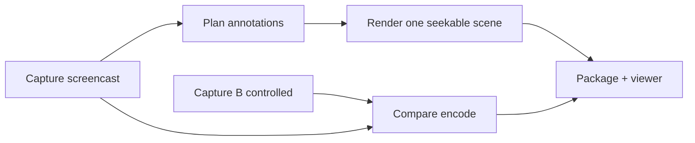

# Repro — Claude Design brief

**Audience:** Claude Design (and any designer / design-model) refining or producing
visual systems, motion, UI, theming, or skill-facing chrome for **Repro**.

**Not for:** implementing capture/render code (use [`ai-usage.md`](ai-usage.md) +
skills). This brief defines **what the product should look and feel like**, what
surfaces exist, token systems, overlay language, and acceptance criteria for
designs.

**Project identity:** Use the approved [Repro logo and branding](branding.md) for documentation and package identity. Evidence overlay colors remain semantic.

**Related docs**

| Doc | Role |
| --- | --- |
| [`ai-usage.md`](ai-usage.md) | Modes, features, bug-class → config (behavioral) |
| [`spikes.md`](spikes.md) | Technical locks (ffmpeg, screencast, redaction) |
| [`../AGENTS.md`](../AGENTS.md) | Agent operating constraints |
| [`../apps/shoplite/`](../apps/shoplite/) | Fixture app (demo content, not product chrome) |
| [`../packages/viewer/`](../packages/viewer/) | Packaged evidence viewer (product UI) |

**Design status:** Repro 0.3.1 uses one polished scene compositor with bundled
typography, coordinated layout, source-timed motion, and adaptive evidence panels.
See [scene presentation](scene-renderer.md) and the [configuration reference](configuration.md)
for shipped behavior and defaults. This brief also contains design proposals;
label future proposals explicitly rather than presenting them as available options.

---

## 1. Product one-liner

**Repro** turns a web bug (or fix) into a **professional, ALM-ready evidence
video**: Playwright-captured screencast + intelligent overlays (steps, clicks,
console, compare layouts, redaction) so developers, testers, and product can
understand the issue without a live session.

Primary deliverable: **H.264 MP4** (plus optional VTT, chapters, JSON report,
packaged viewer). Secondary: packaged static **evidence viewer**.

---

## 2. Who consumes the designs

| Persona | They open | Care about |
| --- | --- | --- |
| **Developer** | Annotated repro / compare MP4 in PR or IDE | Anchored highlights, console toast, before/after geometry |
| **Tester / QA** | Steps, chapters, environment slate | Numbered steps matching ticket, pause/slowmo honesty |
| **Product / PM** | Demo walkthrough MP4 | Clear story, voiceover-friendly pacing, low clutter |
| **ALM reviewer** | Attachment + packaged viewer | Bug ID in filename/slate, redaction trust, accessibility of viewer |
| **Agent author** | Skills + config matrix | Visual defaults that match bug class (icons/colors in docs OK) |

Design for **evidence clarity first**, aesthetic second. Overlays must never
obscure the defect under discussion.

---

## 3. Product surfaces to design

```text
┌─────────────────────────────────────────────────────────────┐
│ A. VIDEO CHROME (burned into MP4 — highest impact)          │
│    Opening slate · step badges · shapes · console · compare │
├─────────────────────────────────────────────────────────────┤
│ B. EVIDENCE VIEWER (packages/viewer — interactive UI)       │
│    Themes · presets · timeline · a11y · redaction blocked   │
├─────────────────────────────────────────────────────────────┤
│ C. AGENT / SKILL AFFORDANCES (docs + future skill cards)    │
│    Mode/feature diagrams · bug-class chips · config recipes │
├─────────────────────────────────────────────────────────────┤
│ D. FIXTURE / DEMO CONTENT (apps/shoplite — not product UI)  │
│    Realistic app under test; keep boring/admin so overlays  │
│    read clearly                                             │
└─────────────────────────────────────────────────────────────┘
```

Out of scope for brand polish: CLI terminal output, SQLite store internals,
ffmpeg filter strings.

---

## 4. Pipeline story (for storyboards)

Design storyboards should follow this narrative arc:

1. **Opening slate (1.5–2.5s)** — Bug ID, title, browser, OS, viewport, mode.
2. **Repro body** — Screencast with anchored callouts; numbered steps; pointer /
   key / console as configured.
3. **Critical beat** — Pause hold and/or slow-mo with speed badge when timing
   matters.
4. **Outcome** — Failure toast, geometry delta, or demo success beat.
5. **Compare (when mode=compare)** — Side-by-side and/or onion composite with
   Before/After labels (not two unrelated files).
6. **Package** — Viewer + named assets for ALM.



---

## 5. Modes, profiles, features (design implications)

### 5.1 Modes (mutually exclusive — different visual “skins”)

| Mode | Visual tone | Signature chrome |
| --- | --- | --- |
| `repro` | Forensic, high-signal | Step badges, severity colors, console toast |
| `compare` | Analytical, dual-pane | Before/After labels, Δ captions, onion legend |
| `demo` | Guided, calmer | Softer badges, narration-friendly lower-thirds |

Do **not** invent a fourth mode in UI copy. Layouts (side-by-side, onion, wipe,
blink, difference, edge) are **compare outputs**, not modes.

### 5.2 Profiles (capture fidelity — subtle UI cues only)

| Profile | Design cue (optional slate chip) |
| --- | --- |
| `faithful` | Chip: “Live timing” |
| `controlled` | Chip: “Deterministic” |

### 5.3 Feature flags → visual components to design

Every flag that can be on should have a **named visual component** with states
(enter / hold / exit). Priority for design exploration:

| Flag / capability | Component to design | Motion notes |
| --- | --- | --- |
| `specCard` / opening slate | Full-frame intro card | Fade/dissolve into video |
| `steps` | Numeric badge `N/M` + chapter lower-third | Badge near target; chapter bottom-safe |
| `clickViz` | Left vs right click ripples | Distinct hues; ~300–500ms |
| `cursor` | Cursor trail / pointer glyph | Low opacity; never hide target |
| `keystrokes` | Key combo pills | Modifiers shown; printable in fields hidden by policy |
| `consoleOverlay` | Bottom toast + trigger outline | Toast + fade on trigger (200/400ms) |
| `pauses` | `PAUSED` badge + hold frame | Centered or corner; high contrast |
| `slowmo` | Speed badge `0.25×` | Corner chip during slowed segment |
| `zoom` | ROI magnifier PiP | Framed inset; keep context |
| `redaction` | Opaque black box | Pre-overlay; outward-rounded measured bounds; never label secrets |
| `vitalsHud` | Compact HUD chip | Corner; CLS/LCP/INP values |
| `freezeDetect` | Freeze banner | Distinct from PAUSED |
| `a11yOverlay` | Violation outline + rule id | Severity-coded |
| `hiddenElements` | Ghost / dashed “hidden but present” | Clearly not “selected” |
| `hitTargets` | Min 24×24 guide | Show actual vs required |
| `stackingContexts` | Z-order labels / layered outlines | Parent vs child |
| `layoutShiftViz` | Dashed shift rect + score | Score in caption |
| `voiceover` | Safe lower-third + caption zone | Reserve bottom ~96px |
| Compare layouts | SBS / onion / wipe / blink / diff / edge | See §7 |

---

## 6. Overlay design language (target)

### 6.1 Principles

1. **Anchored, not floating center** — Labels attach to targets via placement or
   leader; centered full-screen titles only for chapters/slate.
2. **One job per overlay** — Don’t stack toast + three banners + HUD on the same
   beat unless severity demands it.
3. **Collision avoidance** — Prefer auto-placement away from high-variance /
   critical UI; leaders when displaced.
4. **Readable on any app chrome** — Outline + shadow; assume unknown page colors.
5. **Evidence > decoration** — No gratuitous glow, glassmorphism, or emoji.

### 6.2 Semantic colors (burn-in + viewer)

Use these as the **canonical token set**. Map to the scene style configuration and viewer CSS variables.

| Token | Hex (light evidence) | Meaning |
| --- | --- | --- |
| `--repro-add` | `#1B7F4A` | Element/state **added** |
| `--repro-remove` | `#C42020` | Element/state **removed** |
| `--repro-change` | `#C47A00` | Element **changed / moved** |
| `--repro-info` | `#2457D6` | Neutral callout / step |
| `--repro-critical` | `#C42020` | Console error, critical a11y |
| `--repro-warn` | `#996200` | Warning / freeze / CLS |
| `--repro-click-left` | `#0B8FAD` | Primary click ripple |
| `--repro-click-right` | `#B13D8C` | Context-click ripple |
| `--repro-label-fg` | `#FFFFFF` | Text on dark label fill |
| `--repro-label-bg` | `#202020E6` | Label plate (~90% opacity) |
| `--repro-slate-bg` | `#101319` | Opening slate background |
| `--repro-before` | `#5B6B8C` | Compare “Before / Broken” |
| `--repro-after` | `#1B7F4A` | Compare “After / Fixed” |
| `--repro-ring-halo` | `#FFFFFFE6` | Target ring outer halo (`target-ring`) |
| `--repro-plate-hairline` | `#FFFFFF2E` | Label/slate plate border (`label-plate`, HUD) |
| `--repro-meta` | `#B8BFCC` | Slate meta, secondary captions |
| `--repro-scrim` | `#10131980` | Outcome / modal scrim (`outcome-pair`) |
| `--repro-progress` | `#FFFFFFBF` | Step progress bar fill (`step-badge`) |

**Named components using these tokens:** `target-ring`, `label-plate`,
`step-badge`, `console-toast`, `vitals-hud`, `slate`, `compare-chrome`,
`roi-magnifier`, `outcome-pair`.

**Severity mapping**

| Severity | Stroke / accent |
| --- | --- |
| `info` / `low` | `--repro-info` |
| `medium` / `warn` | `--repro-warn` |
| `high` / `critical` | `--repro-critical` |

Avoid purple-primary themes and soft cream “AI landing page” looks for product
chrome. Evidence UI should feel like **instrumentation**, not marketing.

### 6.3 Shapes

| Shape | Use |
| --- | --- |
| **Rect** (rounded 4–8px) | Default element highlight |
| **Ellipse** | Click / hit point |
| **Underline** | Text / contrast issues |
| **Leader + arrowhead** | Displaced label → target |
| **Badge pill** | Step `N/M`, speed, PAUSED |
| **Dashed rect** | CLS region, hidden ghost, suggested hit area |

Line styles: solid (default), dashed (shift/hidden), dotted (low confidence).

### 6.4 Typography (overlays)

| Role | Spec |
| --- | --- |
| Slate title | Sans, 28–36px, semibold, white |
| Slate meta | Sans, 14–16px, muted `#B8BFCC` |
| Step badge | Sans, 14–16px, bold, tabular nums |
| Callout label | Sans, 16–18px, medium; max ~42 chars then truncate |
| Console toast | Mono or sans 14px; single line + ellipsis |
| Geometry caption | Sans 13–14px; e.g. `Δx +12px` |

Prefer a distinctive but sober UI sans for **viewer** (not Inter-by-default if
alternatives are available). Overlays may use a highly legible system sans for
Bundled Source Sans 3 for interface text and Source Code Pro for data.

### 6.5 Safe zones (1280×720 reference)

```text
┌──────────────────────────────────────────────────────────┐
│  SLATE / HUD safe  24px inset                            │
│  ┌────────────────────────────────────────────────────┐  │
│  │                                                    │  │
│  │              Primary content region                │  │
│  │         (prefer callouts here, not edges)          │  │
│  │                                                    │  │
│  └────────────────────────────────────────────────────┘  │
│  CHAPTER / VOICEOVER / CONSOLE  bottom 96px reserved     │
└──────────────────────────────────────────────────────────┘
```

Default capture viewport: **1280×720**, deviceScaleFactor **1**. Design at 1×;
assume no reliance on retina-only detail.

### 6.6 Motion budget

Ship intentional motion, not noise. Recommended defaults:

| Event | Motion |
| --- | --- |
| Slate → content | 250–400ms dissolve |
| Step badge appear | 150ms fade + slight scale 0.96→1 |
| Click ripple | 350ms expand + fade |
| Console toast | Slide/fade 200ms in, hold, 400ms out |
| Trigger highlight | Scene entry/exit transitions |
| Compare wipe | Static 50% or slow animated wipe (optional) |
| Blink compare | 2–4 Hz max; offer static onion as default for a11y |

Reduced-motion: in `controlled` profile, page animations may be disabled; **our**
overlays may still animate briefly for clarity, but avoid continuous blink as the
only encoding of a finding.

---

## 7. Compare layouts (high-priority design)

Produce labeled frame comps for each layout at 1280×720:

| Layout | Composition | Required labels |
| --- | --- | --- |
| **Side-by-side** | Two panes equal width | `BEFORE` / `AFTER` (or Broken/Fixed), bug ID |
| **Onion** | 40–50% opacity blend | Legend: “Onion · 50%” |
| **Wipe** | Vertical or horizontal split | Drag metaphor optional; static OK in MP4 |
| **Blink** | Alternating A/B | Warning: seizure/a11y — not default |
| **Difference** | Blend difference + contrast | “Pixel difference” chip |
| **Edge** | Sobel/edge overlay combo | “Edge overlay” chip |
| **Cropped ROI** | Shared crop around delta | Magnifier border + Δ caption |

Geometry captions: `Δx +12.0px · Δy 0 · Δw 0 · Δh 0` near the changed control.

**Do not** design compare as two separate unlabeled files. The composite frame
**is** the product.

---

## 8. Opening slate (specCard) content model

Design a reusable slate template:

```text
┌────────────────────────────────────────────┐
│  REPRO                          [mode chip]│
│                                            │
│  BUG-1001                                  │
│  Save button misaligned 12px …             │
│                                            │
│  Browser   Chromium 131.x                  │
│  OS        Linux                           │
│  Viewport  1280×720 @1x                    │
│  Profile   controlled · deterministic      │
│  Locale    en-US · UTC                     │
│                                            │
│  ShopLite · ?fixture=broken                │
└────────────────────────────────────────────┘
```

Variants: **repro** (failure), **demo** (walkthrough), **compare** (pair IDs).

---

## 9. Evidence viewer UI (`@jitterbox/repro-viewer`)

### 9.1 Current foundation (extend, don’t discard)

Existing themes: `light` | `dark` | `high-contrast`.  
Reviewer presets: `alm` | `developer` | `product` | `tester` (section sets).

Token seeds (today):

| Token | Light | Dark | High-contrast |
| --- | --- | --- | --- |
| `--surface-canvas` | `#ffffff` | `#101319` | `#000000` |
| `--surface-panel` | `#f7f8fb` | `#1d222b` | `#000000` |
| `--text-primary` | `#101319` | `#f5f7fb` | `#ffffff` |
| `--emphasis` | `#2457d6` | `#84a8ff` | `#ffff00` |
| `--critical` | `#c42020` | (inherit/adapt) | `#ff6b6b` |

### 9.2 Layout to refine

- **Shell:** video primary + side panel (annotations, chapters, env, redaction).
- **Toolbar:** theme, preset, play/pause, chapter jump.
- **States:** `loading` | `ready` | `empty` | `error` | `redaction-blocked`.
- **Keyboard:** Space play/pause; arrows seek chapter/annotation.

### 9.3 Design asks for viewer

1. Clear hierarchy: video is hero; panel is supporting.
2. Annotation list synced to playhead (active row emphasis).
3. Redaction-blocked state: unambiguous, non-alarmist, no secret leakage.
4. High-contrast theme must meet WCAG for text/controls (not only color invert).
5. Chapter markers on timeline scrubber.
6. Optional dual-video compare player (A|B or onion toggle) for packaged compare
   evidence — design even if implementation follows.

---

## 10. Skills & agent-facing design

Skills today: `repro-capture`, `repro-annotate`, `repro-compare`, `repro-file`
(thin CLI wrappers). Planned: evaluate-requirements, create-bugs.

**Design deliverables that help agents/humans:**

| Artifact | Purpose |
| --- | --- |
| Mode / feature diagram (one page) | Mutual exclusivity + composition |
| Bug-class → visual recipe cards | “CLS pack”, “Console pack”, “Compare pack” |
| Do/Don’t overlay sheets | Anchored vs centered; clutter limits |
| ALM naming examples | `{BUG-1001}_repro_broken.mp4` patterns |
| Skill cover cards (optional) | Icon + one-line intent for each skill |

Keep skill visuals **schematic** (diagrams, not marketing sites).

---

## 11. ShopLite fixture (content design only)

ShopLite is a **deliberately plain** e-commerce admin fixture so overlays read
clearly. Do **not** brand ShopLite as Repro product UI.

| Concern | Guidance |
| --- | --- |
| Visual noise | Keep panels flat; avoid competing gradients |
| Broken vs fixed | Same layout; defects are small (offset, contrast, z-index) |
| Testids | Stable `data-testid` for harness |
| Future surfaces | Scroll rails, mutation add/remove, a11y-nameless control, network fail — still plain admin aesthetic |

Reference tokens already in fixture CSS: `--accent: #2457d6`, `--text: #1a1a1a`,
`--danger: #c42020`, gutter `16px`.

---

## 12. Accessibility & safety

| Topic | Requirement |
| --- | --- |
| Overlay contrast | Label text ≥ 4.5:1 on its plate |
| Blink layout | Never default; warn in UI copy |
| Color alone | Pair ADD/REMOVE/CHANGE with icons or labels |
| Viewer focus | Visible 3px focus rings |
| Redaction | Opaque fill before labels; no “SSN: ***” that confirms value; pixelation is not a privacy guarantee |
| Captions | VTT for voiceover; chapters.vtt for jump-to |
| Seizure / vestibular | Prefer onion over blink; limited ripple frequency |

---

## 13. Naming & ALM presentation

| Asset | Pattern (examples) |
| --- | --- |
| Repro video | `BUG-1001_before_repro.mp4` |
| Demo / fix | `BUG-1001_after_repro.mp4` |
| Browser diagnostics | `BUG-1001_before_devtools.json` (default on) |
| Compare SBS | `BUG-1001_compare_sbs.mp4` |
| Compare onion | `BUG-1001_compare_onion.mp4` |
| Package folder | `BUG-1001_evidence/` |

Slate and filename should agree on bug ID. Viewer title = slate title.

---

## 14. Competitive reference (steal UX patterns, not brands)

| Pattern | From | Apply as |
| --- | --- | --- |
| Side-by-side + onion review | Percy / Applitools / DualView | Compare composites §7 |
| Console linked to UI moment | highlight.io session replay | Toast + trigger fade |
| Env header strip | Loom / BrowserStack sessions | Opening slate |
| Step evidence | TestRail / ADO repro attachments | Badges + chapters |
| Geometry captions | Visual AI “what changed” | Δx/Δy callouts |

Repro’s differentiator: **agent-driven, bug-class-configured, ALM-fileable
videos** — not another screenshot CI dashboard.

---

## 15. Current vs target (honest baseline)

| Area | Current (often) | Target |
| --- | --- | --- |
| Callouts | Centered gray title box | Anchored shape + leader + severity color |
| Steps | Chapter text only | `N/M` badge + progress + chapters.vtt |
| Opening | Missing / title-only | Full env slate |
| Compare | Filter strings in JSON | Encoded SBS + onion MP4s with labels |
| Console | Weak/static | Toast + fading trigger highlight |
| Pointer | Mostly absent in burn-in | L/R ripples, drag path, scroll ticks |
| Voiceover | Flag without mux | Narration + captions |
| Viewer | Basic shell | Timeline sync, compare player, HC polish |

Design work should **pull the product toward Target**, not celebrate Current.

---

## 16. Requested design deliverables

When refining or producing designs, prioritize this set:

### P0 — Video system

1. **Overlay kit** — Figma (or equivalent) components: rect, ellipse, underline,
   leader+arrow, badge, toast, HUD, PAUSED, speed chip; all severities.
2. **Opening slate** — repro / demo / compare variants (light-on-dark).
3. **Compare layouts** — SBS, onion, wipe frames with real-looking ShopLite
   mock content and Δ captions.
4. **Step sequence storyboard** — 5–7 frames for a multi-step functional repro.

### P1 — Interaction & motion

5. **Pointer sheet** — left click, right click, drag path, scroll ticks.
6. **Console beat** — storyboard: click → error toast → trigger fade.
7. **Pause / slowmo** — hold frame + badges without clutter.

### P2 — Viewer & skills

8. **Viewer UI** — light / dark / high-contrast; developer + tester presets.
9. **Redaction-blocked** empty/error state.
10. **Skill / mode diagram** — one-page visual for docs.
11. **Bug-class recipe cards** — 6–8 cards aligned with `ai-usage.md` §5.

### Optional

12. Packaged evidence folder mock (file names + viewer).
13. Cropped ROI compare variant.

---

## 17. Acceptance criteria for design reviews

A design package is ready when:

1. Overlay kit uses the **semantic color tokens** in §6.2.
2. No critical callout relies on **center-screen title alone**.
3. Compare frames show **both sides labeled** in one composition.
4. Opening slate includes **bug ID + browser + viewport**.
5. Bottom **96px** reserved in storyboards that include chapters/voiceover/console.
6. High-contrast viewer theme remains keyboard-operable and non-color-only.
7. ShopLite mockups stay **visually subordinate** to overlays.
8. Motion specs list duration/easing for primary components.
9. Each designed feature maps to a **named flag or layout** in §5–§7 (no orphan
   chrome).
10. Explicit **Proposal** labeling for features outside the shipped scene and viewer interfaces.

---

## 18. Prompt starter for Claude Design

Copy/adapt:

> You are designing visual systems for **Repro**, an AI-driven bug-reproduction
> evidence video tool. Read `docs/design-brief.md` as the source of truth for
> surfaces, tokens, overlay language, compare layouts, and acceptance criteria.
> Produce [overlay kit / opening slate / compare frames / viewer UI] at 1280×720
> for video comps and responsive desktop for the viewer. Prefer anchored,
> high-contrast instrumentation aesthetics; avoid marketing/AI-purple tropes.
> Label any frame that exceeds current implementation as **Target**. Map every
> component to a mode, feature flag, or compare layout from the brief.

---

## 19. Change control

| Change type | Update this brief? |
| --- | --- |
| New feature flag with burn-in | Yes — §5.3 + tokens if needed |
| New compare layout | Yes — §7 |
| Viewer IA / theme | Yes — §9 |
| Capture internals only | No |
| ShopLite defect only | §11 if it changes content patterns |

Owners: keep this doc aligned with `ai-usage.md` (behavior) and the video polish
roadmap; when tokens change, update viewer CSS variables and scene styles
together.
